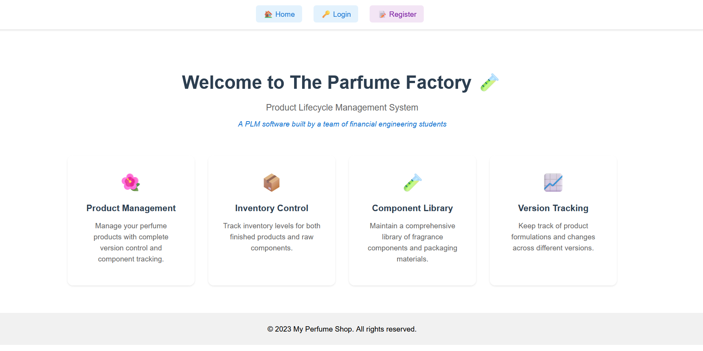

# PLM Software



1. Start a venv:

```bash 
python -m venv venv
```
Activate venv

```bash 
.\venv\Scripts\activate
```
Deactivate venv

```bash 
deactivate
```

2. Download requirements : 

```bash 
pip install -r requirements.txt
```

3. Launch the app 

```bash 
python run.py
```

4. Project Overview

PLM/
│
├── venv/                   # Virtual environment
│
├── app/                    # Application directory
│   ├── __init__.py         # Initializes your Flask application
│   ├── config.py           # Configuration settings
│   ├── models.py           # Database models
│   ├── forms.py            # WTForms for form handling
│   ├── views/              # Application views and routes
│   │   ├── auth.py         # Authentication routes
│   │   ├── product.py      # Product management routes
│   │
│   ├── templates/          # HTML templates
│   │   ├── layout.html     # Base layout
│   │   ├── index.html      # Home page template
│   │   ├── login.html      # Login page template, etc.
│   │
│   ├── static/             # CSS, JavaScript files
│       ├── css/            # CSS files
│       ├── js/             # JavaScript files
│
├── run.py                  # Starts the Flask application
│
└── requirements.txt        # Python dependencies
